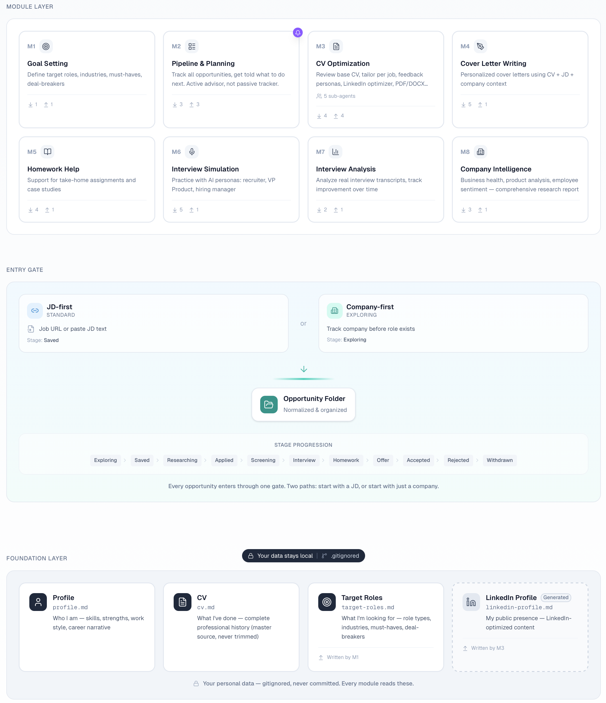

# JobOS

An AI-powered job search system built on [Claude Code](https://docs.anthropic.com/en/docs/claude-code). It manages your CV, tracks opportunities, researches companies, assesses how well you fit a role, and prepares you for interviews — all from markdown files and natural language commands.

JobOS won't make you look better than you are. It won't fabricate experience, inflate achievements, or help you land a role you can't retain. What it will do is force you to think clearly about what you want, prepare thoroughly for what's ahead, and present your real experience in the strongest honest form. The system is deliberately strict — it pushes back when something is vague, flags gaps instead of hiding them, and tells you when a target role is a stretch.

This project is under active development. Some capabilities are fully built and tested, others are designed but not yet implemented. The status of each is marked honestly below.

## What you can do with it

✅ **"I need to tailor my CV for this role."** Paste a job description URL or text. The system analyzes the requirements, maps them against your actual experience, tailors your CV to emphasize what's genuinely relevant, and generates a print-ready PDF and an ATS-safe DOCX. It also tells you where you have gaps — and what to do about them.

✅ **"Help me figure out what I'm actually looking for."** Before applying anywhere, the Goal Setting workflow walks you through target roles, industries, company size, must-haves, and deal-breakers. It challenges vague answers and pushes you to prioritize.

✅ **"What should I focus on today?"** The Planning Advisor scans all your in-flight opportunities, checks what's progressed and what's stalled, and tells you exactly what to do next — in priority order. You just tell it what happened ("had a screening call with Acme, went well") and it handles the rest.

✅ **"Research this company for me."** Before you apply or interview, get a comprehensive report: business health, product analysis, employee sentiment, and an honest assessment of how well the company matches your criteria. An optional LinkedIn deep dive adds leadership profiles, hiring pattern analysis, and PM team composition.

🚧 **"Write a cover letter for this role."** Generates a specific, authentic cover letter grounded in your CV, the job description, and company context. No generic filler.

🚧 **"I have a take-home assignment due Friday."** Helps you structure your approach to case studies and homework tasks — based on what you actually know, not fabricated expertise.

🚧 **"I have an interview tomorrow."** Practice with AI personas that simulate a recruiter, VP Product, and hiring manager.

🚧 **"How did my last interview go?"** Analyze real interview transcripts to identify patterns and feed insights into future prep.

## How it works

JobOS is a Claude Code project — a GitHub repo containing markdown files, agent instructions, and templates. You interact with it through natural language in your terminal or IDE.

The system is structured in three layers: a foundation layer (your professional profile, CV, and target criteria), an entry gate (how job opportunities get into the system), and a module layer (eight capabilities that read your context and produce outputs). Everything about a single opportunity — the job description, your tailored CV, cover letter, company research, activity history — lives in one folder.

Agent instructions in `CLAUDE.md` and `agents/` define how the system behaves. Two principles are hardcoded into every agent:

- **Honesty** — never fabricate, exaggerate, or imply experience that doesn't exist. When a gap exists, flag it transparently.
- **Tough Love** — be constructively critical. No sugarcoating, no generic praise, no over-optimistic outputs. If something is weak, say so and explain why.

## Architecture



[Explore the interactive version →](https://v0-jobos.vercel.app)

## Prerequisites

- [Claude Code](https://docs.anthropic.com/en/docs/claude-code) (CLI or via Cursor/IDE)
- A Claude Pro subscription ($20/month) or higher — the free tier does not include Claude Code access. Alternatively, you can use API credits via a Claude Console account.
- Git and a GitHub account
- Optional: an IDE with terminal support like [Cursor](https://cursor.com) — Claude Code works in any terminal, but an IDE makes file review and iteration easier

## Getting started

See [ONBOARDING.md](ONBOARDING.md) for step-by-step instructions.

The short version: clone the repo, open it in Claude Code, and start talking. The system creates your context files automatically from templates when they're first needed — you just fill them in through conversation.

## Repository structure

```
jobos/
├── CLAUDE.md              ← AI instruction file (auto-loaded by Claude Code)
├── README.md              ← this file
├── ONBOARDING.md          ← step-by-step guide for new users
├── LICENSE                ← MIT
├── context/               ← your personal data (gitignored, never committed)
├── agents/                ← agent instruction files per module
├── templates/             ← blank starter templates
├── scripts/               ← utility scripts (PDF generation, etc.)
├── notifications/         ← optional: daily macOS digest notification
└── opportunities/         ← one folder per job opportunity (gitignored)
```

## Future considerations

These are directions being explored — not commitments. The system may evolve in these ways:

**Proactive job discovery.** Currently, JobOS assumes you've already found an opportunity. A future layer could automatically monitor job boards and company career pages against your criteria, surface matching roles, and feed them into the pipeline for your review — so the system finds opportunities for you instead of waiting for you to find them.

**Always-on assistant via OpenClaw.** JobOS is session-based — it's only active when you open Claude Code. Integration with [OpenClaw](https://openclaw.ai) (an open-source personal AI assistant) could enable always-on capabilities: proactive deadline alerts via WhatsApp or Telegram, context-aware quick responses to recruiter messages while on the go, and intelligent nudges when opportunities go stale — all without opening your IDE.

## License

MIT — do whatever you want with it. See [LICENSE](LICENSE).
